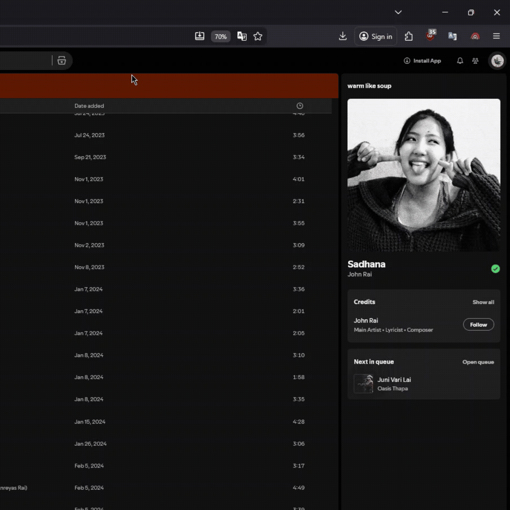
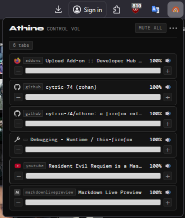

<div align="center">

<br />

<br />

# athine

</div>

## Overview
For controlling the audio volume of each browser tab independently.
For chromium users [here](https://github.com/cytric-74/athine-chromium)
*no data is collected*

<div align="center">
  
</div>

## Installation

### From source

```bash
git clone https://github.com/cytric-74/athine.git
cd athine
```
or you can download the folder - <div align="left"></div>

1. Open Firefox and navigate to `about:debugging`
2. Click **This Firefox** in the left sidebar
3. Click **Load Temporary Add-on…**
4. Open the `athine-firefox` folder and select `manifest.json`

---

<div align="center">
<sub>built by <a href="https://github.com/cytric-74">cytric-74</a></sub>
</div>
